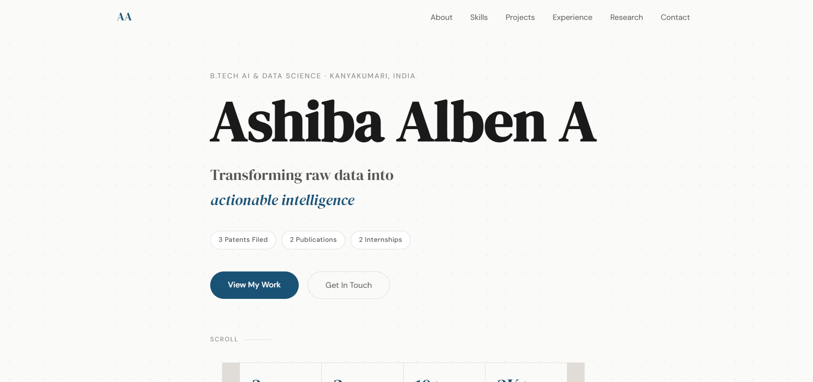
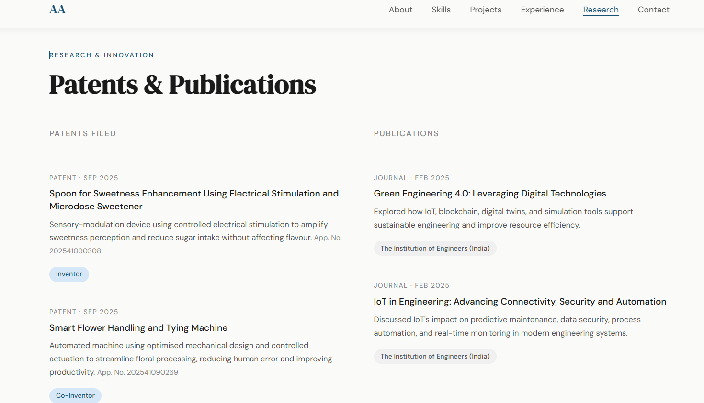
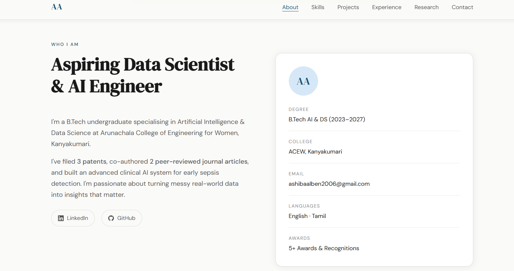

# Ashiba Alben A — Personal Portfolio

> B.Tech AI & Data Science · Patent Holder · Journal Author · Data Science Intern

**Live:** https://ashiba713.github.io | **Backend:** https://ashiba-portfolio.onrender.com

---

## Tech Stack

| Layer      | Technology                        |
|------------|-----------------------------------|
| Frontend   | HTML5, CSS3, Vanilla JavaScript   |
| Backend    | Node.js + Express.js              |
| Database   | MongoDB + Mongoose (MVC pattern)  |
| Email      | Nodemailer + Gmail                |
| Security   | Helmet, CORS, express-rate-limit  |
| Deployment | Render.com (backend)              |

---

## Project Structure (MVC Architecture)

```
ashiba-portfolio/
├── config/
│   ├── db.js          ← MongoDB connection
│   └── seed.js        ← Seed database with portfolio data
├── controllers/
│   ├── contactController.js    ← Contact form logic
│   └── portfolioController.js  ← Portfolio data logic
├── models/
│   ├── Contact.js     ← Contact form schema
│   ├── Project.js     ← Projects schema
│   └── Profile.js     ← Profile/skills/experience schema
├── routes/
│   ├── contactRoutes.js    ← /api/contact
│   └── portfolioRoutes.js  ← /api/projects, /api/profile, /api/skills
├── public/
│   ├── index.html     ← Single-page portfolio (fetches from API)
│   ├── css/style.css  ← All styles
│   └── js/main.js     ← API calls + DOM rendering
├── server.js          ← Express app entry point
├── package.json
├── render.yaml        ← Render.com deployment config
├── .env.example
└── .gitignore
```

---

## RESTful API Endpoints

| Method | Endpoint        | Description                  |
|--------|----------------|------------------------------|
| GET    | /api/profile   | Full profile data             |
| GET    | /api/skills    | Skills list                  |
| GET    | /api/projects  | All projects                 |
| GET    | /api/projects/:id | Single project            |
| POST   | /api/contact   | Submit contact form          |
| GET    | /api/messages  | View all messages (admin)    |
| GET    | /api/health    | Server health check          |

---

## Local Setup

### 1. Clone & Install
```bash
git clone https://github.com/ashiba713/ashiba-portfolio.git
cd ashiba-portfolio
npm install
```

### 2. Environment Variables
```bash
cp .env.example .env
# Edit .env with your values
```

Your `.env` file:
```
PORT=3000
NODE_ENV=development
MONGO_URI=mongodb://localhost:27017/portfolio
EMAIL_USER=ashibaalben2006@gmail.com
EMAIL_PASS=your_gmail_app_password
```

> **Gmail App Password:** Go to myaccount.google.com → Security → 2-Step Verification → App Passwords

### 3. Seed the Database
```bash
node config/seed.js
```

### 4. Run Locally
```bash
npm run dev
```

Open: **http://localhost:3000**

---

## Deployment (Render.com)

1. Push code to GitHub
2. Go to [render.com](https://render.com) → New → Web Service
3. Connect your GitHub repo
4. Set environment variables in Render dashboard:
   - `MONGO_URI` — your MongoDB Atlas URI
   - `EMAIL_USER` — your Gmail
   - `EMAIL_PASS` — your Gmail App Password
5. Deploy!

---
## Screenshots





Built with care by **Ashiba Alben A** · Kanyakumari, Tamil Nadu
